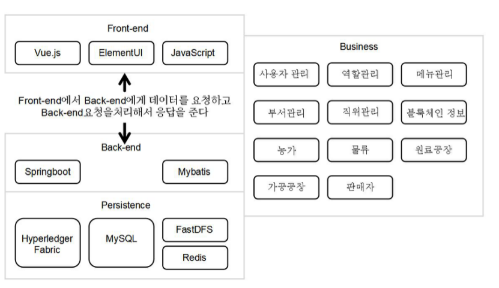

# 정보컴퓨터공학부 2023년 졸업과제 조이름좀추천해조

## 농산물 근원 탐구과 시스탬관리 플랫품
<hr>

### 1. 프로젝드 소개
프로젝트 명: 농산물 근원 탐구와 시스템관리 플랫폼
### 목적
- 기업관리자에게 웹사이트 형태의 서비스 제공
이 시스템은 농가/기업 가공 공장에 농산물 정보를 기록하고 관리할 수 있는 도구를 	제공하여 제품을 더 잘 이해하고 후속 제품 판매 및 마케팅 전략에 도움이 된다.
- 소비자에게 농산물 정보 조회 제공
소비자 로그인 없이 소비자조회창에서 판매자가 제공하는 조회번호를 통해 농산물 	및 블록체인 정보를 조회할 수 있다.
- 시스템관리자는 기업관리자 및 소비자를 위해 안정한 시스템 제공
농산물 근원 탐구 시스템은 블록체인 기술을 활용하여 제품의 완전성과 신뢰성을 보	장한다. 데이터 변경과 위조를 방지하여 제품의 안전성 을 높이다. 이 시스템은 제품	의 투명성과 근원 탐구 가 능성을 높이면서 기업관리자 및 소비자에게 더 많은 선택	과 안정을 제공한다.

### 내용
- 농산물 근원 탐구 시스템 및 식품안전: 농산물의 근원 탐구 시스템을 구축함으로써 농산물의 생산지, 생산과정, 사용되는 농약 및 비료 등의 정보를 근원 탐구하여 농산물의 안전과 품질을 보장할 수 있다.
- 농산물 근원 탐구 시스템 및 품질 인증: 농산물 근원 탐구 시스템을 통해 소비자는 유기농 인증, 무공해 인증 등을 포함한 농산물의 인증 정보를 확인할 수 있다. 인증 정보는 소비자가 구매 결정을 내리고 시장에서 한국 농산물의 경쟁력을 높이는 데 도움이 될 수 있다.
- 농산물 근원 탐구 시스템 및 수출 요구 사항: 농산물 근원 탐구 시스템을 통해 농산물이 잔류 농약 및 품질 표준의 테스트를 포함하여 한국 수입국의 요구 사항을 충족하는지 확인할 수 있다. 농산물 수출업자들이 한국 시장의 요구를 충족시키고 더 많은 수출 기회를 개척하는 데 도움이 될 것이다.
- 농산물 근원 탐구 시스템 및 브랜드 가치: 농산물 근원 탐구 시스템을 통해 농산물 생산 및 공급망 정보를 근원 탐구 및 표시할 수 있어 신뢰할 수 있는 브랜드 이미지를 구축하는 데 도움이 된다. 농산물 근원 탐구 시스템은 제품에 대한 소비자의 신뢰를 높이고 제품의 시장 가치를 높일 수 있다.
- 농산물 근원 탐구 시스템 및 시장 수요: 농산물 근원 탐구 시스템을 통해 농산물 정보를 소비자에게 보다 투명하게 보여주고 제품 품질 및 이력 근원 탐구성에 대한 요구를 충족시킬 수 있다. 이는 우리 농산물이 시장에서 더 큰 인지도와 경쟁 우위를 획득하는 데 도움이 된다.
- 블록체인 기술 및 근원 투명성: 블록체인 기술을 사용하여 농산물의 생산, 가공, 배송 등 기타 부분의 데이터를 변조할 수 없는 블록체인에 안전하게 기록할 수 있다. 이러한 시스템은 농산물 이력 근원 탐구의 투명성을 제공하고 정보의 진정성과 신뢰성을 보장할 수 있다. 한국 농산물 시장에서 블록체인 기반 근원 탐구 시스템은 제품 품질과 안전에 대한 소비자의 신뢰를 높일 수 있다.

<hr>

### 2. 팀소개
<table>
    <tr>
        <td>학번</td>
        <td>202055535</td>
        <td>202055562</td>
        <td>202055654</td>
      <td></td>
    </tr
    <tr>
        <td>이름</td>
        <td>리보양</td>
        <td>쑹위판</td>
        <td>장우정</td>
    </tr>
    <tr>
        <td>이메일</td>
        <td>liboyang@pusan.ac.kr</td>
        <td>songyufan@naver.com</td>
        <td>jangujeong@pusan.ac.kr</td>
    </tr>
        <tr>
        <td>역할</td>
        <td>● 웹 UI 설계 및 개발 <br>● 프런트 엔드와 백 엔드 API 상호 작용을 실현 <br>● 보고서 작성</td>
        <td>● Database & Server환경 구축 <br>●블록체인 네트워크 구성 <br>● 백엔드 시스템에서 블록체인 기술 기능 실현<br>● 보고서 작성</td>
        <td>● Database & Server환경 구축 <br>● 백엔드 시스템의 아키텍처 설계와 기능 실현 <br>● API 테스트</td>
    </tr>
</table>
<hr> 

### 3. 구성도


### 4. 소개 및 시연 영상

<hr>

### 5. 사용법

#### hyperledger fabric
● 아래 링크를 통해 hyperledger fabric 공식 문서을 참고하고 설치한다.<a href="https://hyperledger-fabric.readthedocs.io/en/latest/getting_started.html">hyperledger fabric 공식 문서</a><br>
●  hyperledger fabric이 요구하는 docker, golang 등 모든 요소를 설치해야 한다.
●  Redis 및 FastDFS 설치해야 한다.
● application.yml 파일 중 Redis주소와 Fastdfs주소를 수정해야 한다.
```
  # redis
  redis:
    # 주소
    host: 127.0.0.1
    # 포트
    port: 6379
    # 비밀번호
    password: 

  fdfs:
      so-timeout: 1501
      connect-timeout: 601
      thumb-image:
        width: 60
        height: 60
      tracker-list: 
      address: 
```
● application.yml 파일 중 mysql주소를 수정해야 한다.
```
# mysql
spring:
    datasource:
        type: com.alibaba.druid.pool.DruidDataSource
        driverClassName: com.mysql.cj.jdbc.Driver
        druid:
            master:
                url: 
                username: 
                password: 
```
#### webUI
1. 의존성 설치
> npm install --registry=https://registry.npm.taobao.org

2. 연결된 블록체인 네트워크 주소 수정
main.js，ip주소를 블록체인 네트워크가 있는 서버 주소로 수정하였다.
```
Vue.prototype.$httpUrl = "http://localhost:8080/";
```
3. 프로젝트 시작
> npm run dev  

